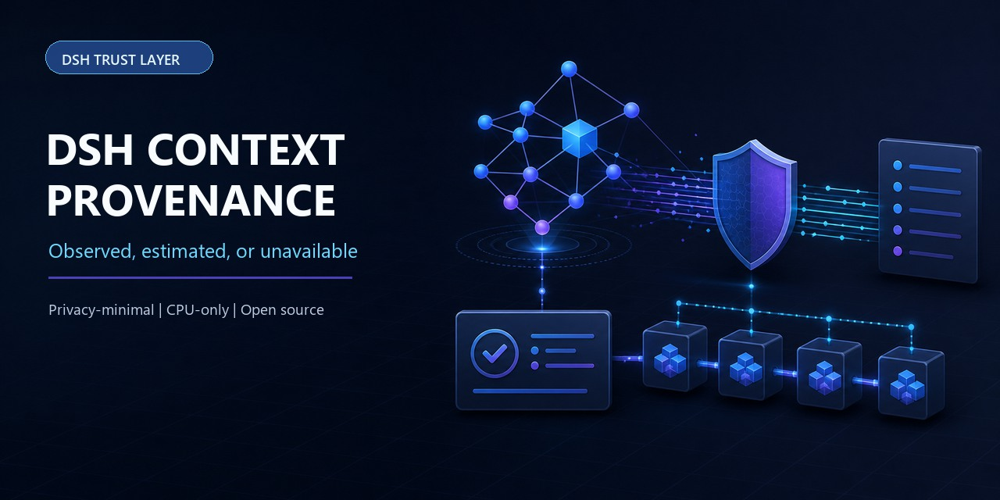

# dsh-context-provenance

[](https://github.com/030611/dsh-context-provenance/actions/workflows/ci.yml)
[](https://www.npmjs.com/package/dsh-context-provenance)
[](LICENSE)



**Compare adjacent request evidence as `Observed`, `Estimated`, or `Unavailable`—without returning prompt text, message content, tool schemas, or raw paths.**

```sh
dsh plugin --profile web add dsh-context-provenance
```

> Community-maintained and not an official DeepSeek project. Related trust-layer plugins: [Telemetry Redactor](https://github.com/030611/dsh-telemetry-redactor), [Verification Receipt](https://github.com/030611/dsh-verification-receipt), and [Evidence Audit](https://github.com/030611/qiushi-dsh-evidence-audit).

An observe-only, CPU-only, local-only DeepSeek Harness plugin that reports what public runtime interfaces can actually prove about the requesting Agent's context. It retains only the two most recent ordinary agent-loop request observations in memory and exposes them through the existing Cordis inspect query mechanism. It performs no file, network, subprocess, GPU, persistence, session, permission, tool, model-routing, or request mutation.

## Audit verdict

Conditional pass against official DSH commit `47f943859bef60e4160492346772ded9b24f765a`. Stable public seams exist for a deliberately incomplete evidence ledger. This plugin is not a complete context provenance graph and cannot explain all behavior differences.

Public collision review found official `pluginInventory/list`, official token-meter projections, official Cordis inspect, and the community `dsh-context-doctor`. This plugin does not rescan files, reimplement token estimation, add optimization advice, or add another token-breakdown UI. Its distinct surface is strict evidence labeling plus adjacent actual request comparison.

## Evidence matrix

| Field | Label | Public interface | Boundary |
|---|---|---|---|
| Effective request provider/model | Observed | `llm/stream` `GenerateOptions`, gated by `isAgentLoopRequest()` | Ordinary Agent-loop requests only |
| Adapter context window | Observed | `Session.requestContext()` | Adapter-advertised capacity, optional |
| System presence/change | Observed | `GenerateOptions.system` | No text or digest is returned; change uses a process-random keyed comparison kept only in memory |
| Tool names/catalog change | Observed | `GenerateOptions.tools` | No descriptions, parameter schemas, or digest is returned |
| Tool owner/plugin mapping | Unavailable | Public `ToolSchema` has no owner | No inference from names |
| Active AGENTS source categories | Observed | Durable `user/message.source.kind=agent-instructions` changes | Only workspace-root/workspace-nested/outside-workspace; raw paths withheld |
| Skill name/source/provider categories | Observed or partial | `ctx.skills.snapshot({ cwd, scope })` | Raw custom source/provider identifiers withheld; `complete=false` is incomplete |
| Loader order/module-kind/enabled/fiber phase | Observed | Official `pluginInventory/list` service | `entryId` and `moduleName` withheld; not contribution provenance |
| System/tools/messages breakdown | Estimated | Official `contextBreakdown` projection | Fixed heuristic; not provider tokenization or billing |
| Prompt pressure | Observed | Official `contextPressure.pressureTokens` | Derived from provider-reported usage buckets |
| Projected next prompt | Estimated | Official `contextPressure.projectedTokens` | Provider anchor plus heuristic delta |
| Hidden policies/private prompts/hidden tools | Unavailable | No public interface | Never claimed or inferred |
| Complete behavior causality | Unavailable | No public interface | Adjacent changes are correlation, not explanation |

Every returned field carries `Observed`, `Estimated`, or `Unavailable`, its source interface, and a boundary note where needed. Missing services, projection keys, optional fields, or incomplete skill discovery degrade per field; absence is never silently converted to zero.

## Usage

Add the bundle to a profile, restart DSH, then use the existing inspect tools to query Host provider `ContextProvenance`, method `report`. The provider appears when the official Cordis inspect service is present; an older composition without that service still mounts the observer but has no query surface. The provider is model-visible only when a user or model explicitly inspects it; the plugin adds no new tool schema or ordinary request content.

## Installation and compatibility boundary

The public source repository is [030611/dsh-context-provenance](https://github.com/030611/dsh-context-provenance). Add the public bundle to the selected DSH profile, then inspect the resolved configuration:

```sh
dsh plugin --profile <profile> add dsh-context-provenance
dsh --profile <profile> --dump-config
```

Before installing, verify the registry version, source tag, and release notes rather than treating an untagged repository checkout as a release artifact.

The public-interface audit is pinned to official DSH commit `47f943859bef60e4160492346772ded9b24f765a` and covers the rc.5 source seam. Local package gates and the temporary tarball installation/import smoke are exercised with the locked rc.6 development dependency set; the peer range remains exactly rc.5/rc.6. These are source/API, unit, lifecycle, loader-composition, built-artifact, patch, and package-install checks. They are not a claim of end-to-end Web UI, remote API, or live model/provider testing.

## Privacy and lifecycle

Request bodies are synchronously reduced at the `llm/stream` boundary to provider/model, booleans, safe categories, tool names, and official numeric projections. System text, messages, tool descriptions, JSON parameter schemas, raw plugin identifiers, raw skill provider/source identifiers, and AGENTS paths or contents are never returned.

**Equality fingerprints are not privacy protection.** A plain SHA-256 digest of a low-entropy or known prompt/schema lets an observer confirm guesses offline. Earlier schema version 1 returned such digests; schema version 2 removes them. Adjacent `systemChanged` and `toolCatalogChanged` booleans are computed from process-random keyed fingerprints held only in a private WeakMap and are never serialized. These booleans still reveal equality/change across the retained adjacent pair, which is the minimum comparison signal this plugin intentionally exposes.

AGENTS folding is incremental per live Agent. The first request after plugin load performs one O(session events) catch-up; subsequent requests examine only newly appended events. If a session event view shrinks, the fold safely rebuilds from the visible tail. The in-memory two-request and instruction-state WeakMaps, request listener, and inspect registration become unreachable or are disposed with the plugin Fiber. Restarting or unloading loses all observations.

## Version degradation

The official repository is pre-release and advertises no session-format compatibility promise. This package binds only published package exports and public methods/events at the pinned audit commit. Missing optional services or newer fields produce `Unavailable`; a missing `cordisInspect` service removes only the report surface and does not prevent the observer from mounting.

## Model experience

The plugin adds one entry and one method to the existing Cordis inspect provider directory. Ordinary model requests receive no added prompt, message, or tool schema. A deliberate inspect call returns the bounded evidence report, which then enters normal tool-result history under the existing Cordis inspect tool.

### Token and KV-cache effect

No direct effect on ordinary requests. A deliberate inspect call adds its bounded result to conversation history. The existing inspect tool schema remains unchanged.

## Known limitations

- Loader entries do not identify the bundle, profile, override, or dependency that introduced them.
- Plugin inventory reveals ordered enablement and lifecycle categories, but never raw entry ids, package names, file URLs, absolute paths, or patch specifiers.
- A tool name or schema does not identify its owning plugin.
- Skill names remain visible because they are the public callable identity; source/provider are reduced to fixed categories. A skill name itself may still be sensitive if a deployment chooses a sensitive name.
- AGENTS location categories are durable injected-source metadata, not a filesystem inventory or proof of hidden instructions.
- Adjacent observations cover actual ordinary `llm/stream` calls seen while this plugin is mounted. Earlier requests, auxiliary calls, and observations lost on unload or restart are unavailable.
